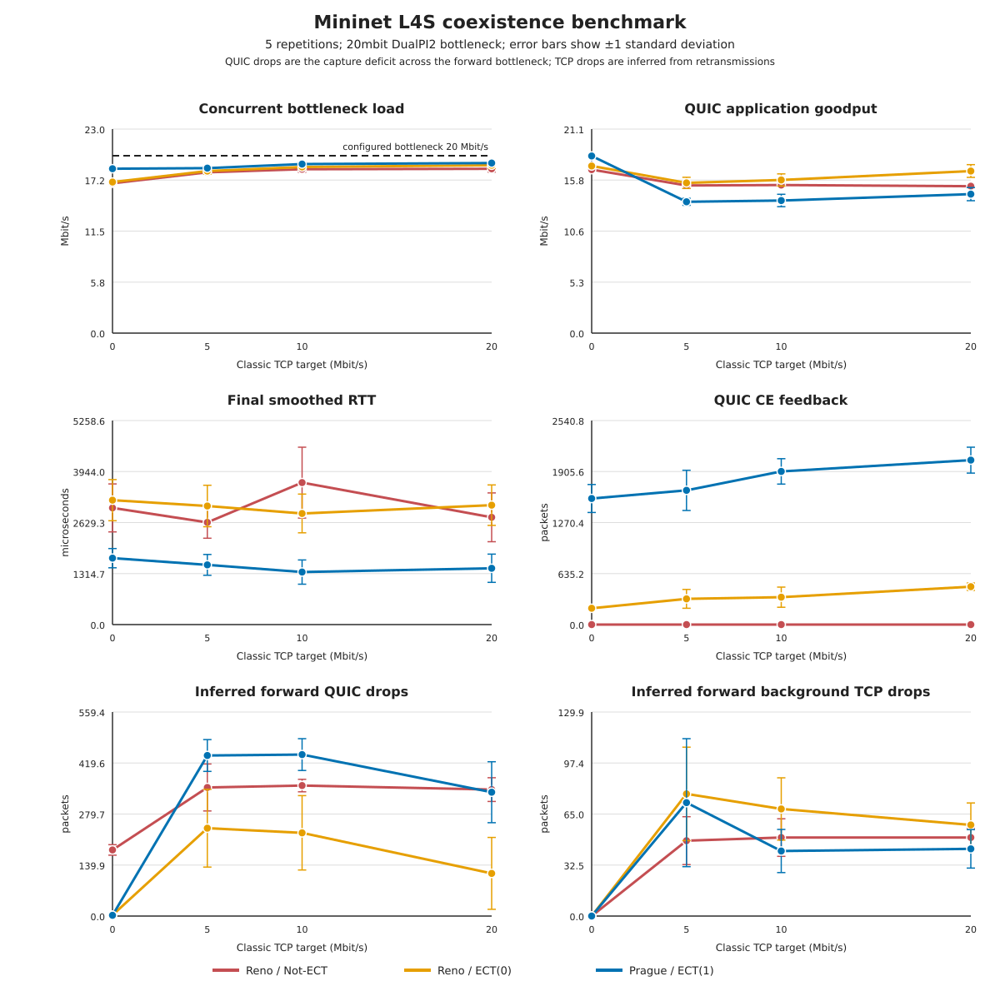

# Mininet L4S coexistence benchmark

Run the benchmark from the host with:

```sh
make l4s-mininet-benchmark-check
```

The command boots an ephemeral overlay of `~/sandbox/p4/work.qcow2`, builds the
committed IMQUIC and picoquic revisions inside it, and creates this Mininet
topology:

```text
client --- s1 (Open vSwitch, HTB 20 Mbit/s + DualPI2) --- server
```

The same IMQUIC transfer runs in three modes: Reno/Not-ECT (`l4s-off`),
Reno/ECT(0) (`l4s-ect0`), and Prague/ECT(1) (`l4s-on`). The ECT(0) mode isolates
classic ECN behavior from Prague's congestion controller and L4S queue
classification. At the same time, iperf3 sends paced TCP from client to server
with TCP ECN disabled. The default requested TCP rates are 0, 5, 10, and 20
Mbit/s, and every load/mode combination runs five times.

Each case recreates both switch-port qdiscs so counters do not leak between
runs. The analyzer separates QUIC (`udp.port == 4443`) from background TCP
(`tcp.port == 5201`) and verifies Not-ECT, ECT(0), ECT(1), CE marking, ACK_ECN
feedback, and at least 70% observed bottleneck utilization for every selected
mode.

The concurrent-load measurement sums client-to-server QUIC and TCP IP bytes
captured during the exact QUIC wall-clock interval. This avoids combining QUIC
goodput with an iperf3 average measured over a different duration. The generated
SVG plots mean values with one-standard-deviation error bars and draws the
configured capacity directly on the concurrent-load panel. Its final two panels
show forward-path packet drops by flow. QUIC drops are inferred from the packet
count deficit between the client- and server-side switch captures. Because TCP
GSO coalesces packets in the ingress capture, background drops are inferred from
forward TCP retransmissions instead. The analyzer also records the forward
DualPI2 drop counter so the attribution can be checked against the qdisc total.

## Latest combined evidence

Kernel: `5.15.72-48b3db6b4-prague-111`; Mininet: `2.3.1b4`; transfer: 4 MiB;
five repetitions per point (60 cases total). Values are mean ± sample standard
deviation. Per the incremental-run request, the 20 ECT(0) cases were run after
the already-recorded 40 Not-ECT/ECT(1) cases; the earlier modes were not rerun.

| TCP target (Mbit/s) | QUIC goodput: Not-ECT / ECT(0) / Prague (Mbit/s) | Final RTT: Not-ECT / ECT(0) / Prague (us) | CE feedback: ECT(0) / Prague |
|---:|---:|---:|---:|
| 0 | 16.92±0.10 / 17.30±0.10 / 18.34±0.03 | 3008±618 / 3207±531 / 1712±248 | 203±19 / 1570±174 |
| 5 | 15.29±0.31 / 15.55±0.58 / 13.59±0.36 | 2634±409 / 3056±535 / 1539±268 | 320±117 / 1671±251 |
| 10 | 15.32±0.15 / 15.85±0.63 / 13.72±0.64 | 3659±913 / 2864±498 / 1354±313 | 341±125 / 1907±158 |
| 20 | 15.21±0.19 / 16.78±0.66 / 14.39±0.68 | 2764±630 / 3078±521 / 1452±364 | 472±46 / 2048±161 |



## Why Prague has lower loaded goodput

It does not have lower goodput at zero background load: Prague averaged 18.34
Mbit/s versus 16.92 for Not-ECT Reno and 17.30 for ECT(0) Reno. It is lower at
the three nonzero loads.

The third mode shows that the gap is not caused by ECN marking alone. ECT(0)
Reno received CE feedback yet slightly exceeded Not-ECT Reno goodput at every
load. The key difference is signal frequency and queue/controller behavior:

- DualPI2 classifies ECT(1) into its low-latency queue and ECT(0)/Not-ECT into
  its classic queue. Prague received 1,570--2,048 mean CE feedback packets per
  transfer, while ECT(0) Reno received only 203--472.
- Prague updates its alpha every feedback era, reduces cwnd proportionally to
  alpha, and excludes CE-marked bytes from additive cwnd growth. Under the
  sustained scalable marking in these short transfers, its mean final cwnd was
  3.5--4.9 KiB, versus 6.2--8.0 KiB for ECT(0) Reno.
- That smaller operating window trades throughput for queue control. Prague's
  mean final smoothed RTT was 1.35--1.71 ms, substantially below both Reno
  variants, while its loaded goodput was 1.96--2.39 Mbit/s below ECT(0) Reno.

Thus this experiment shows an observed latency/short-transfer-goodput tradeoff
under this DualPI2 configuration, not an ECT-bit processing penalty. It is
still a short 4 MiB completion-time benchmark: final RTT and cwnd are end
snapshots, and the incrementally collected modes were not randomized in one
interleaved run. The five repetitions and standard deviations are descriptive,
not a formal significance test.

Across all 60 cases, background TCP had zero ECN-marked packets. All Not-ECT
runs had zero ECN feedback; every ECT(0) run had capture-visible ECT(0), CE,
and ACK_ECN CE feedback; every Prague run had ECT(1), CE, and ACK_ECN feedback.
At nonzero background loads, the mean sum of inferred QUIC and TCP drops was
within six packets of the mean forward DualPI2 counter in every plotted point.
The zero-load ECN modes show a two-to-three-packet capture deficit even when the
qdisc reported no drops, which gives the practical noise floor for this
capture-based inference.

Override the matrix without editing scripts:

```sh
make l4s-mininet-benchmark-check \
  L4S_BENCHMARK_RATES=2,8,14,18 \
  L4S_BENCHMARK_BYTES=8388608 \
  L4S_BENCHMARK_BOTTLENECK=20mbit \
  L4S_BENCHMARK_SECONDS=12 \
  L4S_BENCHMARK_REPETITIONS=5
```

To reproduce only the ECT(0) addition and merge it with the frozen two-mode
baseline, run:

```sh
make l4s-mininet-ect0-check
```

The command produces `summary.csv`, `aggregate.csv`, `analysis.json`, and
`comparison.svg` automatically. Full CSV trajectories, iperf JSON, qdisc
counters, logs, and pcaps are copied to
`results/l4s/qemu-mininet-benchmark-<timestamp>/`, which is ignored by Git.
